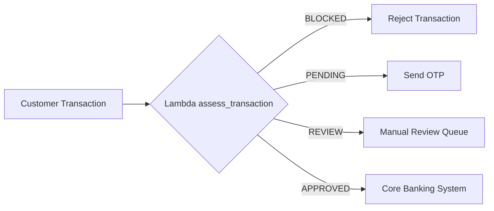

# Week 2 Compute Notes

## EC2 vs Lambda vs ECS

### Amazon EC2
Amazon EC2 provides virtual servers in the cloud and gives full control over the operating system, networking, and installed software.

**Best for:**
- Long-running applications
- Custom software installations
- Full server administration

### AWS Lambda
AWS Lambda is a serverless compute service that runs code in response to events.

**Best for:**
- Event-driven processing
- APIs
- Automation tasks
- Short-lived workloads

**Advantages:**
- No server management
- Automatic scaling
- Pay only when code runs

### Amazon ECS
Amazon Elastic Container Service (ECS) runs containerised applications using Docker.

**Best for:**
- Microservices
- Containerised applications
- Applications requiring portability

## FinTrust Decision

The FinTrust transaction decision engine would be best deployed on AWS Lambda because:

- It is stateless
- It processes one transaction at a time
- It scales automatically
- It reduces operational overhead
- It is cost-effective for event-driven workloads

## Architecture Diagram

## Key Learning

This week I learned how SQL JOINs and aggregate functions help produce business analytics from banking data. I also learned how Python conditionals can be used to build transaction decision engines and why AWS Lambda is a suitable compute service for event-driven workloads.