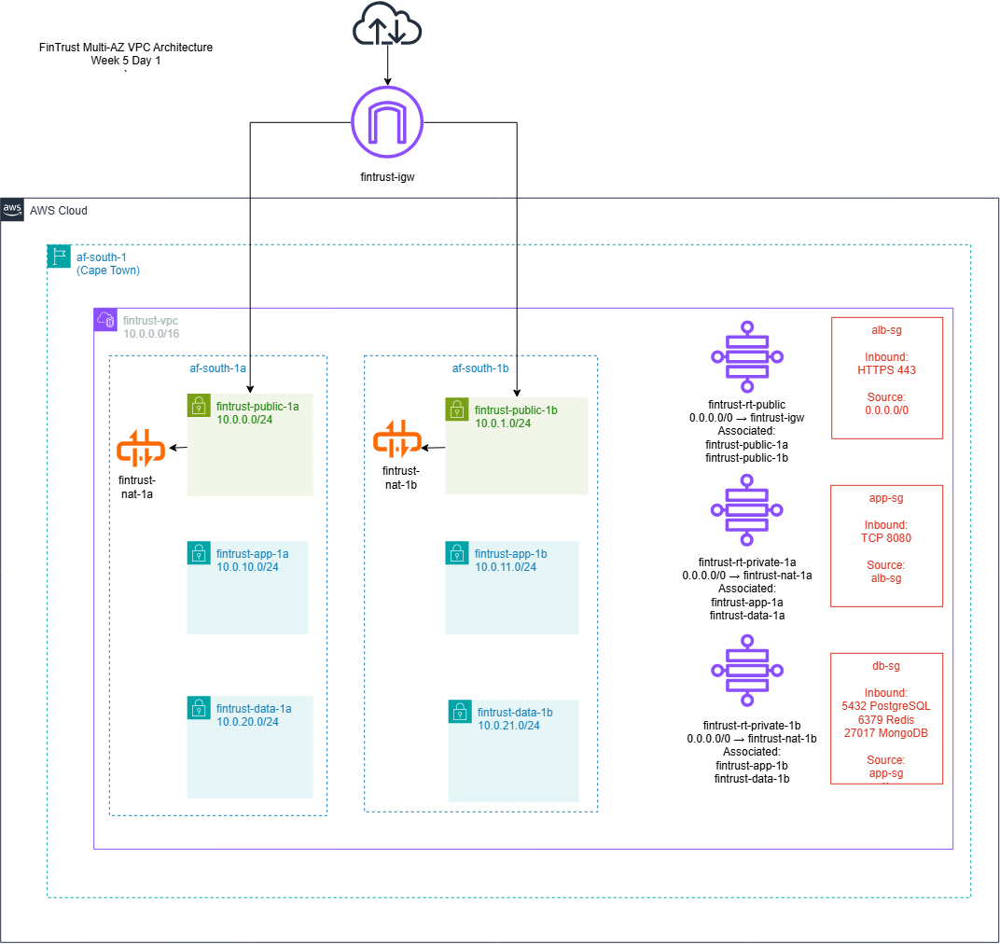
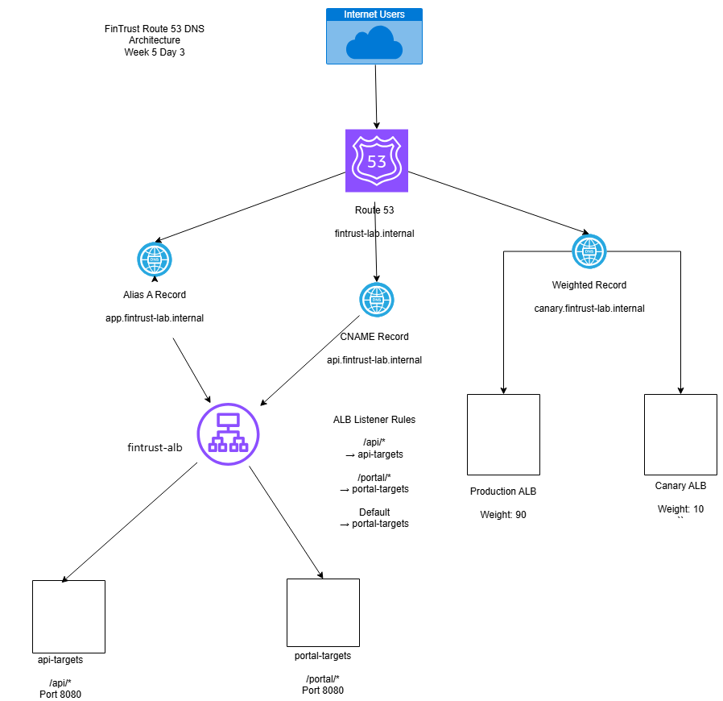

# Week 5 - AWS Networking, Connectivity and DNS

## Overview

This week focused on AWS networking, connectivity, load balancing, and DNS services. The FinTrust architecture was extended to include a highly available Multi-AZ VPC, Application Load Balancer routing, hybrid connectivity design, and Route 53 DNS management.

---

## Day 1 - Multi-AZ VPC Architecture

### Deliverables

- Multi-AZ VPC design
- Public, application, and data subnets
- Internet Gateway configuration
- NAT Gateway high-availability architecture
- Route tables
- Security groups

### Files

```text
day1_vpc_build.md
fintrust-vpc.drawio
fintrust-vpc.png
```

### Architecture Diagram



---

## Day 2 - Connectivity and Load Balancing

### Deliverables

- Application Load Balancer design
- Path-based routing
- Transit Gateway architecture
- PrivateLink design
- Direct Connect architecture
- Client VPN connectivity

### Files

```text
day2_connectivity.md
```

---

## Day 3 - Route 53 and DNS Architecture

### Deliverables

- Route 53 hosted zone
- Alias A records
- CNAME records
- Weighted routing configuration
- Canary deployment design

### Files

```text
day3_route53.md
route53.drawio
route53.png
```

### Architecture Diagram



---

## Key AWS Services Covered

### Networking

- Amazon VPC
- Internet Gateway
- NAT Gateway
- Route Tables
- Security Groups

### Connectivity

- AWS Transit Gateway
- AWS PrivateLink
- AWS Direct Connect
- AWS Client VPN
- VPC Peering

### Load Balancing

- Application Load Balancer (ALB)
- Target Groups
- Path-Based Routing

### DNS

- Amazon Route 53
- Alias Records
- CNAME Records
- Weighted Routing
- Failover Routing
- Geolocation Routing
- Latency Routing

---

## Learning Outcomes

By the end of Week 5 I was able to:

- Design a highly available Multi-AZ VPC architecture.
- Configure secure network segmentation using subnets and security groups.
- Select appropriate AWS connectivity services for hybrid and multi-account environments.
- Design ALB path-based routing for microservices architectures.
- Implement Route 53 DNS routing strategies including weighted routing for canary deployments.
- Explain when to use Transit Gateway, PrivateLink, Direct Connect, and VPC Peering.

---

## FinTrust Architecture Summary

The FinTrust solution uses:

- A Multi-AZ VPC in AWS Africa (Cape Town).
- Public subnets for internet-facing resources.
- Private application and data tiers.
- An Application Load Balancer for Layer 7 routing.
- Route 53 for DNS and traffic management.
- Transit Gateway for scalable VPC connectivity.
- Direct Connect for hybrid connectivity to on-premises systems.